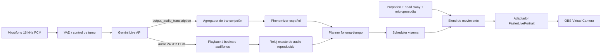
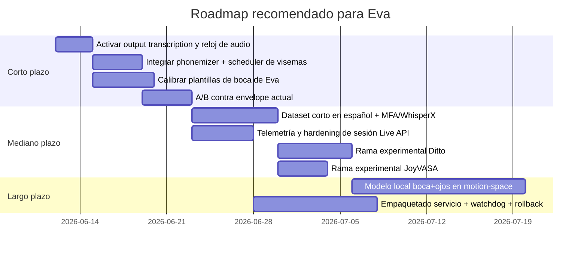

# Arquitectura de producción para un avatar fotorealista conversacional en vivo en español

## Resumen ejecutivo

Con el stack que ya tienes, la ruta con mejor relación entre calidad percibida, riesgo de uncanny valley y viabilidad operativa **no** es un generador full-face de audio a movimiento como ruta principal. La recomendación para producción es mantener **FasterLivePortrait como renderer único**, y reemplazar la capa autónoma actual por un **scheduler de fonemas/visemas en español** que use la **transcripción de salida del Gemini Live API** y convierta esa transcripción en movimientos discretos y muy controlados de boca, sumando solo micro-movimiento procedimental de ojos y cabeza. Esta recomendación está alineada con la arquitectura oficial de LivePortrait, que separa claramente representación de movimiento implícita, pose, deformación de expresión y render; también con la evidencia del paper de LivePortrait sobre controlabilidad, y con la documentación actual del Live API, que ya soporta transcripciones de audio de salida. citeturn18view0turn33view1turn33view2turn12view2turn11view0

La razón técnica es clara: LivePortrait expone internamente un diccionario `kp_info` con `pitch`, `yaw`, `roll`, `t`, `exp`, `scale` y `kp`; `kp` y `exp` se remodelan como `BxNx3`, y el pipeline oficial ya separa índices de labios y ojos para control parcial. Eso permite inyectar movimiento de boca **sin tocar el renderer** y sin entregar el control facial completo a un modelo generativo. Además, el wrapper oficial incluye `retarget_lip`, `retarget_eye`, `stitching` y `warp_decode`, lo que hace natural insertar una capa de control intermedia. citeturn33view1turn33view2turn34view1turn34view3turn35view0

Para la parte conversacional, hoy la documentación oficial lista **Gemini 3.1 Flash Live Preview** y **Gemini 2.5 Flash Live Preview** como modelos de audio en vivo; 2.5 está posicionado como el modelo insignia para agentes bidireccionales de voz y video con razonamiento nativo en audio, mientras que 3.1 se presenta como un modelo A2A de alta calidad y baja latencia. La misma documentación aclara que, en modelos de audio nativo, la modalidad de salida es `AUDIO` y que, si necesitas texto para subtítulos o lip-sync, debes habilitar `output_audio_transcription`. También advierte que en 3.1 un solo evento puede contener varias partes, por lo que tu cliente debe procesarlas todas. citeturn37view7turn11view0turn12view2

En términos de roadmap, la apuesta correcta es: **corto plazo**, congelar el renderer y migrar `eva_platica.py` a una ruta “audio + output transcription + phonemizer + viseme scheduler + lip override”; **mediano plazo**, crear un corpus corto de Eva en español y calibrar plantillas locales de boca con alineación offline; **largo plazo**, experimentar en ramas separadas con Ditto y, solo si gana de forma objetiva y ciega, considerar una ruta motion-space más rica. Ditto es prometedor porque publica configuración online/offline y motores TensorRT “Ampere_Plus”, pero su entorno probado oficial es CentOS 7.2 + Python 3.10 + TensorRT 8.6.1, así que en tu Windows 11 con TensorRT 9.0.1 debe tratarse como experimento aislado y no como cambio directo de producción. citeturn5view5turn37view5turn37view6

## Arquitectura objetivo

### Supuestos de entrada

Este documento parte de los datos que diste como fijos: Windows 11, Python 3.10 en el venv de FasterLivePortrait, RTX 2000 Ada Laptop GPU de 8 GB con tope térmico/energético, render con FasterLivePortrait TensorRT, `assets\eva_source.png` como identidad visual, `run_realtime_trt.py` para puppet mode, `eva_platica.py` para modo autónomo, Gemini Live API para voz conversacional, `sounddevice` para audio de entrada/salida y OBS Virtual Camera para exponer el avatar a Meet/Teams.

### Diagrama del sistema recomendado



La pieza central es el **Adaptador FasterLivePortrait**: una capa delgada que recibe pesos de visema y señales procedimentales, y los convierte en deltas sobre `exp` o sobre el estado de keypoints transformados, para luego llamar a `stitching` y `warp_decode`. Eso explota exactamente el tipo de control que LivePortrait ya formaliza: keypoints implícitos, deformación de expresión, pose y stitching de bajo costo. citeturn18view0turn33view2turn34view1turn35view0

### Punto de inyección recomendado

En el wrapper oficial de LivePortrait, `get_kp_info()` devuelve un dict con las claves `pitch`, `yaw`, `roll`, `t`, `exp`, `scale` y `kp`; después, `kp` y `exp` se convierten a `BxNx3`. Más adelante, `transform_keypoint()` aplica la transformación `s * (R * x + exp) + t`, y luego el pipeline pasa por `stitching()` y finalmente `warp_decode()`. Esa secuencia define el punto de intervención correcto: **inyectar tu movimiento justo antes de `stitching()`/`warp_decode()`**, no dentro del renderer. citeturn33view1turn33view2turn35view0

La estructura pública que sí puede afirmarse con respaldo documental es esta:

| Campo | Forma documentada |
|---|---|
| `kp_info["kp"]` | `BxNx3` |
| `kp_info["exp"]` | `BxNx3` |
| `kp_info["pitch"]`, `["yaw"]`, `["roll"]` | `Bx1` tras refinado |
| `kp_info["t"]` | vector de traslación |
| `kp_info["scale"]` | escala por batch |
| `retarget_eye(...)` | retorna `BxNx3` |
| `retarget_lip(...)` | retorna `BxNx3` |
| `stitch(...)` | retorna `Bx(3*num_kp+2)` |
| `stitching(...)` | retorna `BxNx3` listo para warping |

La fuente oficial no publica un nombre semántico estable para cada keypoint implícito. Sí hay, sin embargo, evidencia fuerte de que el pipeline referencia índices **hasta 20**, por ejemplo para labios `[6, 12, 14, 17, 19, 20]` y ojos `[11, 13, 15, 16, 18]`, lo que implica **al menos 21 puntos implícitos indexados 0–20**. A la vez, un comentario del wrapper menciona `1x20x3`, lo que vuelve el conteo público **inconsistente**. Por lo tanto, para tu implementación debes tratar la semántica de esos 21 puntos como **no especificada oficialmente** y resolverla con calibración local sobre Eva. citeturn33view0turn34view3turn35view0

### Calibración local de los puntos de boca

Tu mejor práctica aquí no es adivinar qué significa cada índice, sino **medirlo**. Haz un “sweep” offline: suma una pequeña perturbación a cada índice de `exp[i]` por separado, renderiza una imagen, y etiqueta visualmente cuáles índices abren mandíbula, retraen comisuras, redondean labios, cierran labios o deforman mejilla. Dado que el pipeline oficial ya usa el subconjunto `[6, 12, 14, 17, 19, 20]` como región de labios, empieza ahí, pero guarda un mapa local estable para tu rig de Eva. Esto es especialmente importante porque LivePortrait trabaja con **keypoints implícitos**, no con blendshapes nombrados. citeturn18view0turn33view0turn33view2

## Integración en `eva_platica.py`

### Cambios de alto nivel

La modificación correcta de `eva_platica.py` es convertirlo de un flujo “audio entrante → playback + mouth envelope” a uno de **dos carriles sincronizados**:

1. **Carril de audio real**: reproduce el PCM 24 kHz tal como llega del Live API y mantiene un reloj preciso de audio consumido.
2. **Carril textual/lingüístico**: consume `output_audio_transcription`, calcula fonemas/visemas y programa las trayectorias labiales contra el reloj del audio.

Esto es viable porque la documentación oficial del Live API soporta transcripción de audio de salida con `output_audio_transcription`, y porque las respuestas de audio se reciben como chunks PCM 24 kHz. Además, si migras a 3.1, debes procesar todas las partes del evento porque pueden venir varias en el mismo mensaje. citeturn12view2turn11view0

### Interfaz mínima a introducir

Añade tres componentes explícitos a tu código:

```python
from __future__ import annotations
from dataclasses import dataclass, field
from typing import Dict, List, Optional, Protocol, Tuple
import numpy as np

@dataclass
class AudioClock:
    sample_rate: int = 24000
    played_samples: int = 0

    def on_played(self, pcm_bytes: bytes) -> None:
        self.played_samples += len(pcm_bytes) // 2  # int16 mono

    @property
    def now_ms(self) -> float:
        return (self.played_samples / self.sample_rate) * 1000.0


@dataclass
class PhonemeEvent:
    start_ms: float
    end_ms: float
    phoneme: str
    viseme: str
    strength: float = 1.0


@dataclass
class VisemeFrame:
    t_ms: float
    weights: Dict[str, float]


class AvatarRenderer(Protocol):
    def render(self, viseme_weights: Dict[str, float], blink: float, head_pose: Tuple[float, float, float]) -> np.ndarray:
        ...
```

Después, `eva_platica.py` debe operar con un `MotionController` que consuma transcripción de salida y audio reproducido:

```python
@dataclass
class MotionController:
    audio_clock: AudioClock
    backlog: List[PhonemeEvent] = field(default_factory=list)
    last_transcript: str = ""

    def on_output_transcript(self, text: str) -> None:
        raise NotImplementedError

    def frame_controls(self) -> Tuple[Dict[str, float], float, Tuple[float, float, float]]:
        raise NotImplementedError
```

### Configuración del Live API

Para producción, deja de depender de texto implícito o de hacks de ASR secundarios cuando el propio Live API ya te da transcripción de salida. Además, **pinea el nombre de modelo actual documentado** en una variable de entorno, porque los nombres preview antiguos se mueven y cambian. Hoy la documentación pública lista `gemini-2.5-flash-live-preview` y `gemini-3.1-flash-live-preview` para Live audio. citeturn37view7turn11view0turn36search7

```python
# Ejemplo ilustrativo; ajusta nombres de campos si usas raw websocket en vez del SDK oficial.
import os
import asyncio
from google import genai
from google.genai import types

MODEL_NAME = os.getenv("GEMINI_LIVE_MODEL", "gemini-2.5-flash-live-preview")

LIVE_CONFIG = {
    "response_modalities": ["AUDIO"],
    "output_audio_transcription": {},
    "input_audio_transcription": {},
    "system_instruction": (
        "Responde siempre en español latinoamericano. "
        "Habla con frases claras, naturales y no demasiado largas."
    ),
}

async def run_live(session_handler):
    client = genai.Client()
    async with client.aio.live.connect(model=MODEL_NAME, config=LIVE_CONFIG) as session:
        async for response in session.receive():
            sc = getattr(response, "server_content", None)

            # Audio chunks
            if sc and getattr(sc, "model_turn", None):
                for part in sc.model_turn.parts:
                    if getattr(part, "inline_data", None):
                        pcm24k = part.inline_data.data
                        session_handler.on_audio_chunk(pcm24k)

            # Output transcription
            if sc and getattr(sc, "output_transcription", None):
                session_handler.on_output_transcript(sc.output_transcription.text)
```

### Alineación fonémica offline recomendada

Para construir tu dataset de calibración, comparar variantes y estimar mejores plantillas, usa **Montreal Forced Aligner** con el modelo acústico de español y su diccionario oficial. El modelo acústico MFA para español está destinado explícitamente a la alineación forzada de transcripciones en español, y el diccionario oficial usa el mismo phone set. WhisperX también documenta forced alignment y VAD, así que es una buena segunda ruta para análisis retrospectivo y etiquetado rápido. citeturn37view1turn37view2turn37view0

```python
# Ejemplo de alineación offline con MFA.
# Requiere: mfa instalado, un corpus dir con audio.wav y audio.txt del mismo basename.

from pathlib import Path
import subprocess
import shutil

def run_mfa_alignment(audio_wav: str, transcript_txt: str, workdir: str) -> Path:
    audio_wav = Path(audio_wav)
    transcript_txt = Path(transcript_txt)
    workdir = Path(workdir)
    corpus_dir = workdir / "corpus"
    out_dir = workdir / "aligned"
    corpus_dir.mkdir(parents=True, exist_ok=True)
    out_dir.mkdir(parents=True, exist_ok=True)

    shutil.copy2(audio_wav, corpus_dir / audio_wav.name)
    shutil.copy2(transcript_txt, corpus_dir / transcript_txt.name)

    # Ajusta los nombres del modelo/diccionario a tu instalación local.
    cmd = [
        "mfa", "align",
        str(corpus_dir),
        "spanish_mfa_dictionary",
        "spanish_mfa",
        str(out_dir),
        "--clean",
        "--single_speaker",
    ]
    subprocess.run(cmd, check=True)
    return out_dir

# Después parsea el TextGrid resultante y extrae intervalos phone-level.
```

Si lo que quieres es una ruta más simple para crear un corpus de comparación, WhisperX puede servir como herramienta de transcripción + timestamps + alineación multinlingüe, y luego MFA puede quedarse como “gold-ish aligner” para tus clips más importantes. citeturn37view0turn37view1

### Alineación streaming recomendada

En vivo, no necesitas forced alignment perfecto; necesitas **estabilidad perceptual**. La estrategia robusta en tu caso es:

- usar la transcripción incremental del Live API;
- convertirla a fonemas con `phonemizer` usando `espeak-ng`;
- asignar duraciones relativas por fonema;
- reescalar esas duraciones al tiempo real del audio ya reproducido;
- aplicar anticipación y smoothing.

`phonemizer` ofrece función Python y CLI, y usa `espeak-ng` como backend con soporte IPA y muchos idiomas. citeturn37view3turn37view4turn25search0

```python
from __future__ import annotations
from dataclasses import dataclass, field
from typing import List
from phonemizer import phonemize

PHONE_COST = {
    # Vocales: dominan el núcleo visual
    "a": 1.10, "e": 1.00, "i": 0.95, "o": 1.05, "u": 1.00,
    # Cierres / consonantes muy visibles
    "m": 0.70, "b": 0.65, "p": 0.65, "f": 0.70, "β": 0.60,
    # Fricativas y africadas
    "s": 0.65, "x": 0.70, "tʃ": 0.75, "ʝ": 0.65,
    # Alveolares y neutras
    "t": 0.55, "d": 0.55, "n": 0.55, "l": 0.55, "r": 0.50, "ɾ": 0.45,
    # Velares
    "k": 0.55, "g": 0.55,
}

def longest_common_prefix(a: str, b: str) -> int:
    n = min(len(a), len(b))
    i = 0
    while i < n and a[i] == b[i]:
        i += 1
    return i

def text_to_phones_es(text: str) -> List[str]:
    # Ajusta el code según tu instalación local de eSpeak; "es" suele ser la opción práctica.
    raw = phonemize(
        [text],
        language="es",
        backend="espeak",
        strip=True,
        preserve_punctuation=False,
        with_stress=False,
    )[0]
    phones = [p for p in raw.split() if p.strip()]
    return phones

@dataclass
class StreamingPhonemeAligner:
    last_text: str = ""
    last_audio_ms: float = 0.0
    horizon_ms: float = 220.0

    def on_transcript(self, full_text: str, audio_now_ms: float) -> List[PhonemeEvent]:
        lcp = longest_common_prefix(self.last_text, full_text)
        delta_text = full_text[lcp:].strip()
        self.last_text = full_text

        if not delta_text:
            return []

        phones = text_to_phones_es(delta_text)
        if not phones:
            return []

        costs = [PHONE_COST.get(p, 0.60) for p in phones]
        total = sum(costs) or 1.0

        start = max(self.last_audio_ms, audio_now_ms - 30.0)  # un poco de anticipación textual
        end = max(audio_now_ms + self.horizon_ms, start + 80.0)
        duration = end - start

        events = []
        cursor = start
        for phone, cost in zip(phones, costs):
            span = duration * (cost / total)
            ev_start = cursor
            ev_end = cursor + span
            events.append(
                PhonemeEvent(
                    start_ms=ev_start,
                    end_ms=ev_end,
                    phoneme=phone,
                    viseme=map_phone_to_viseme(phone),
                    strength=1.0,
                )
            )
            cursor = ev_end

        self.last_audio_ms = cursor
        return events
```

### Mapeo fonema-visema recomendado para español

La RAE describe el sistema fonológico del español como uno de **24 fonemas**: **5 vocálicos** y **19 consonánticos**. Para animación facial no conviene mantener 24 categorías visuales; la literatura procedural y de coarticulación insiste en que los fonemas se agrupan many-to-one en visemas, y que el contexto fonético modifica mucho la forma visible final. En otras palabras: para producción en vivo, **menos visemas bien temporizados** suelen verse mejor que muchos visemas mal resueltos. citeturn38search0turn38search2turn22view0

La propuesta práctica es la siguiente:

| Visema | Fonemas españoles sugeridos | Apariencia objetivo |
|---|---|---|
| `SIL` | pausa, respiración, final de sílaba débil | relajado / casi cerrado |
| `MBP` | /m b p/ | cierre labial completo |
| `FV` | /f/ y variantes labiodentales visibles | labio inferior contra dientes |
| `A` | /a/ | máxima apertura vertical |
| `EI` | /e i/ y glides palatales vecinas | apertura media / estirada |
| `OU` | /o u/ | redondeado / protrusión |
| `C_NEUTRAL` | /t d n l s r ɾ k g x tʃ ʝ ɲ/ | mandíbula ligera, boca neutra o contextual |

Esto es una **heurística de ingeniería**, no una taxonomía lingüística pura. Se apoya en el inventario fonológico del español y en la evidencia de que la coarticulación domina la percepción visual de la boca. Si sigues usando solo tres bocas reales minadas, entonces la versión mínima viable es todavía más compacta: `MBP`, `A/EI`, `OU`, más el neutral base de la foto. citeturn38search0turn22view0

```python
def map_phone_to_viseme(phone: str) -> str:
    if phone in {"m", "b", "p"}:
        return "MBP"
    if phone in {"f", "β"}:
        return "FV"
    if phone in {"a"}:
        return "A"
    if phone in {"e", "i", "j"}:
        return "EI"
    if phone in {"o", "u", "w"}:
        return "OU"
    return "C_NEUTRAL"
```

### Scheduler de visemas con anticipación y smoothing

La literatura de coarticulación y visemas procedural subraya que el problema no es solo elegir un visema por fonema, sino **cómo se solapan y dominan unos a otros**. Para tu stack, eso se traduce en cuatro reglas muy concretas:

- las **vocales** deben dominar visualmente;
- los **bilabiales** necesitan al menos una clausura clara;
- los visemas deben **anticiparse** unos milisegundos;
- la transición debe estar suavizada para no introducir “jaw jitter”. citeturn22view0turn22view2

Mis parámetros iniciales para producción serían estos:

| Parámetro | Valor inicial |
|---|---|
| anticipación vocal | 35–45 ms |
| anticipación consonante | 10–20 ms |
| hold mínimo de `MBP` | 40–70 ms |
| smoothing ataque | 25–35 ms |
| smoothing release | 55–85 ms |
| límite de cambio por frame | 0.10–0.18 por frame |
| look-ahead total | 50–70 ms |

```python
import math
from collections import defaultdict

VISEMES = ["SIL", "MBP", "FV", "A", "EI", "OU", "C_NEUTRAL"]

class VisemeScheduler:
    def __init__(self, fps: float = 15.0):
        self.fps = fps
        self.events: List[PhonemeEvent] = []
        self.prev = {v: 0.0 for v in VISEMES}

    def push(self, events: List[PhonemeEvent]) -> None:
        self.events.extend(events)
        self.events.sort(key=lambda e: (e.start_ms, e.end_ms))

    def weights_at(self, t_ms: float) -> Dict[str, float]:
        raw = defaultdict(float)

        for ev in self.events:
            start = ev.start_ms - (40.0 if ev.viseme in {"A", "EI", "OU"} else 15.0)
            end = ev.end_ms
            if t_ms < start or t_ms > end:
                continue

            center = 0.5 * (start + end)
            half = max(20.0, 0.5 * (end - start))
            x = (t_ms - center) / half
            w = math.exp(-0.5 * x * x) * ev.strength
            raw[ev.viseme] = max(raw[ev.viseme], w)

        if not raw:
            raw["SIL"] = 1.0

        # normalización suave
        s = sum(raw.values()) or 1.0
        cur = {v: raw.get(v, 0.0) / s for v in VISEMES}

        # low-pass / smoothing
        alpha_attack = 0.45
        alpha_release = 0.20
        out = {}
        for v in VISEMES:
            target = cur[v]
            alpha = alpha_attack if target > self.prev[v] else alpha_release
            out[v] = self.prev[v] + alpha * (target - self.prev[v])

        # clamp rate per frame
        max_step = 0.14
        for v in VISEMES:
            delta = out[v] - self.prev[v]
            if delta > max_step:
                out[v] = self.prev[v] + max_step
            elif delta < -max_step:
                out[v] = self.prev[v] - max_step

        self.prev = out
        return out
```

### API de override hacia FasterLivePortrait

Como no tengo tu árbol local, no puedo afirmar el nombre exacto de la clase TensorRT de tu fork. Lo correcto es encapsular el renderer actual detrás de un adaptador que emule los puntos de extensión documentados por LivePortrait: `get_kp_info`, `extract_feature_3d`, `transform_keypoint`, `stitching`, `warp_decode`, `parse_output`. Si en tu fork esos nombres difieren, los mapeas una sola vez aquí. citeturn33view1turn33view2turn34view3turn35view0

```python
from __future__ import annotations
import copy
import numpy as np
import torch

class LivePortraitLipAdapter:
    # Basado en los subconjuntos que usa el pipeline oficial.
    LIP_IDXS = [6, 12, 14, 17, 19, 20]
    EYE_IDXS = [11, 13, 15, 16, 18]

    def __init__(self, lpw, source_prepared: torch.Tensor):
        """
        lpw: wrapper/local adapter equivalente a LivePortraitWrapper
        source_prepared: tensor Bx3xHxW ya preprocesado
        """
        self.lpw = lpw
        self.source_prepared = source_prepared
        self.src_info = self.lpw.get_kp_info(source_prepared, flag_refine_info=True)
        self.kp_source = self.lpw.transform_keypoint(self.src_info)
        self.feature_3d = self.lpw.extract_feature_3d(source_prepared)
        self.device = self.kp_source.device

        # Plantillas por visema. Cada valor es delta_exp sobre BxNx3.
        N = self.src_info["exp"].shape[1]
        zeros = np.zeros((N, 3), dtype=np.float32)
        self.templates = {
            "MBP": zeros.copy(),
            "FV": zeros.copy(),
            "A": zeros.copy(),
            "EI": zeros.copy(),
            "OU": zeros.copy(),
            "C_NEUTRAL": zeros.copy(),
        }

        # EJEMPLO: estos valores deben salir de tu calibración visual local.
        for idx in self.LIP_IDXS:
            self.templates["A"][idx, 1] += 0.010   # más apertura vertical
            self.templates["MBP"][idx, 1] -= 0.007 # cierre
            self.templates["OU"][idx, 0] += 0.004  # redondeo / protrusión aproximada
            self.templates["EI"][idx, 0] -= 0.003  # estiramiento aproximado
            self.templates["FV"][idx, 1] -= 0.002
            self.templates["C_NEUTRAL"][idx, 1] += 0.001

    def _blend_templates(self, viseme_weights: dict[str, float]) -> torch.Tensor:
        total = np.zeros_like(next(iter(self.templates.values())))
        for name, weight in viseme_weights.items():
            if name in self.templates:
                total += self.templates[name] * float(weight)
        return torch.from_numpy(total).unsqueeze(0).to(self.device)  # 1xNx3

    def render(self, viseme_weights: dict[str, float], blink: float, head_pose: tuple[float, float, float]) -> np.ndarray:
        kp_info = {}
        for k, v in self.src_info.items():
            kp_info[k] = v.clone() if isinstance(v, torch.Tensor) else copy.deepcopy(v)

        exp_delta = self._blend_templates(viseme_weights)
        kp_info["exp"] = kp_info["exp"] + exp_delta

        # Blink mínimo procedimental sobre el subconjunto de ojos.
        for idx in self.EYE_IDXS:
            kp_info["exp"][:, idx, 1] -= 0.004 * float(blink)

        # Head sway ligero. Ajusta sólo si tu wrapper acepta estos valores tal cual.
        yaw_deg, pitch_deg, roll_deg = head_pose
        if isinstance(kp_info["yaw"], torch.Tensor):   kp_info["yaw"] = kp_info["yaw"] + yaw_deg
        if isinstance(kp_info["pitch"], torch.Tensor): kp_info["pitch"] = kp_info["pitch"] + pitch_deg
        if isinstance(kp_info["roll"], torch.Tensor):  kp_info["roll"] = kp_info["roll"] + roll_deg

        kp_driving = self.lpw.transform_keypoint(kp_info)
        kp_driving = self.lpw.stitching(self.kp_source, kp_driving)

        out = self.lpw.warp_decode(self.feature_3d, self.kp_source, kp_driving)
        frame = self.lpw.parse_output(out["out"])[0]
        return frame
```

La nota importante es esta: **si tu implementación local de FasterLivePortrait no expone el wrapper PyTorch**, la idea sigue siendo la misma. Debes crear un adaptador equivalente que reciba un `kp_driving` o `exp_delta` y lo inyecte antes del warping TRTeado. Si tu fork solo permite driving por video/audio/pkl, entonces la integración alternativa es serializar cada frame de visema a un `pkl` de motion y alimentarlo como driving sintético. FasterLivePortrait documenta soporte de `pickle` driving y también API deployment, así que esa ruta es válida si el wrapper interno no es fácilmente accesible. citeturn37view5turn37view6

## Fonema, prosodia y motion procedimental

### Heurísticas de temporización

Tu meta no es reproducir fonética académica perfecta; es que el espectador perciba una sincronía convincente y estable. El trabajo clásico de SyncNet reporta que los desfaces perceptibles para el espectador promedio aparecen aproximadamente alrededor de **audio retrasado ~125 ms** o **audio adelantado ~45 ms** respecto al video. Eso no te da un número mágico para labios generados, pero sí justifica un objetivo duro: mantener la boca **ligeramente adelantada o prácticamente sincronizada**, nunca claramente rezagada. citeturn22view2

Por eso recomiendo estas reglas:

- el eje principal de sincronía lo marca la **apertura vocálica**, no las consonantes;
- un bilabial debe cerrar claramente aunque sacrifiques un poco de fidelidad acústica local;
- si la transcripción llega tarde, **prefiere boca neutra antes que inventar gestos**;
- cuando haya duda, reduce movimiento lateral y deja solo cierre/apertura + redondeo mínimo.

La literatura procedural sobre visemas y coarticulación respalda esta prioridad: los fonemas no se convierten uno a uno en poses estáticas, sino en trayectorias donde el contexto domina. citeturn22view0

### Parpadeo y head sway

Tus parámetros iniciales deberían ser deliberadamente conservadores:

| Componente | Valor inicial recomendado |
|---|---|
| intervalo entre parpadeos | 3.5–6.5 s con jitter |
| cierre de párpado | 70–110 ms |
| reapertura | 120–180 ms |
| parpadeo durante habla intensa | reducir frecuencia ~20% |
| sway de yaw | ±1.2° a ±1.8° |
| sway de pitch | ±0.4° a ±0.8° |
| sway de roll | ±0.2° a ±0.5° |
| frecuencia sway | 0.15–0.35 Hz |
| micro-nod por énfasis/punto | 0.6°–1.0° |

La regla de oro es que el movimiento procedimental **acompañe** a la voz pero nunca compita con la boca. Evita cejas generativas, sonrisas automáticas y grandes cambios de pose en la ruta principal hasta que tengas métricas y A/B claros.

```python
import math
import random

class ProceduralMotion:
    def __init__(self):
        self.next_blink_ms = 0.0
        self.blink_phase = 0.0
        self.seed = random.random() * 1000.0

    def blink_value(self, t_ms: float) -> float:
        if t_ms >= self.next_blink_ms:
            self.next_blink_ms = t_ms + random.uniform(3500.0, 6500.0)
            self.blink_phase = t_ms

        dt = t_ms - self.blink_phase
        if 0 <= dt < 80:
            return dt / 80.0
        if 80 <= dt < 220:
            return 1.0 - ((dt - 80.0) / 140.0)
        return 0.0

    def head_pose(self, t_ms: float, speaking_energy: float = 0.0) -> tuple[float, float, float]:
        t = t_ms / 1000.0
        yaw = 1.4 * math.sin(2 * math.pi * 0.22 * t + self.seed)
        pitch = 0.6 * math.sin(2 * math.pi * 0.17 * t + 0.7 * self.seed)
        roll = 0.3 * math.sin(2 * math.pi * 0.19 * t + 1.4 * self.seed)

        # habla más fuerte -> un poco más de energía, pero muy poco
        yaw *= (0.8 + 0.2 * speaking_energy)
        pitch *= (0.8 + 0.3 * speaking_energy)
        return (yaw, pitch, roll)
```

## Rendimiento, latencia y hardening

### Presupuesto de latencia

En tu laptop el cuello de botella ya está claro: GPU móvil de 8 GB con límite de potencia. Eso obliga a optimizar para **latencia estable**, no para throughput máximo. TensorRT documenta que batching, CUDA Graphs y multi-streaming pueden aumentar paralelismo, pero también introduce la advertencia de que el beneficio viene con mayor uso de memoria y posible contención. En un avatar único, en tiempo real y con 8 GB, el patrón correcto es casi siempre **batch = 1** y colas pequeñas. citeturn7view0turn7view1turn7view3

Mi presupuesto objetivo sería este:

| Etapa | Objetivo |
|---|---|
| chunk de audio de salida | 20–40 ms |
| agregación de transcripción | < 10 ms |
| G2P + planificación | < 5 ms por update |
| scheduler por frame | < 1 ms |
| render avatar | lo que permita tu engine, con cola máxima de 1 frame |
| buffer hacia OBS | 1–2 frames, no más |

La decisión operacional es importante: si el renderer se atrasa, **descarta estados de visema viejos** y renderiza el estado más reciente. En un agente en vivo, el espectador perdona mejor una pérdida de interpolación que una boca rezagada medio segundo.

### Ajustes de TensorRT y memoria

TensorRT y su guía de benchmarking/optimización sugieren varias palancas que sí aplican a tu caso:

- usa **profiling y benchmarking reproducibles** antes de tocar parámetros;
- construye motores con **shapes fijos o muy estrechos** alrededor de tu resolución real;
- usa **timing cache** para reducir tiempos de build;
- vigila memoria de workspace y, si hace falta, limita pools explícitamente;
- considera `maxAuxStreams=0` cuando la prioridad sea memoria;
- usa multi-stream solo si el benchmark realmente mejora la latencia en tu GPU. citeturn7view0turn7view1turn7view3

Aplicado a tu stack, eso se traduce en:

| Palanca | Recomendación |
|---|---|
| batch | fijo en 1 |
| precision | FP16 como predeterminado |
| INT8 | solo después de QA visual severo |
| shapes | fija `min=opt=max` si la entrada no cambia |
| aux streams | `0` al principio para ahorrar memoria |
| timing cache | sí, persistido en disco |
| CUDA graphs | sí, solo si tu wrapper lo soporta sin romper I/O |
| colas | `audio=pequeña`, `motion=1`, `render=1` |

La guía oficial de TensorRT también señala que CUDA Graph capture exige streams no bloqueantes y copias asíncronas; y el tutorial oficial de PyTorch sobre `pin_memory()` y `non_blocking=True` confirma que mover tensores desde memoria pinned ayuda a hacer transferencias host→device más eficientes. Además, `torch.inference_mode()` está pensado precisamente para inferencia y evita parte del bookkeeping de autograd. Use eso en cualquier parte de PyTorch que aún quede viva en tu pipeline fuera de TensorRT. citeturn7view3turn26search1turn26search0

### Qué sí optimizar primero en tu caso

Debes priorizar, en este orden:

1. **evitar motion generators pesados** como default;
2. **hacer el scheduling fuera de GPU**;
3. **reducir copias CPU↔GPU** a una por frame, idealmente;
4. **desactivar paste-back** durante desarrollo interactivo;
5. **separar audio, motion y render en threads/colas independientes**;
6. **usar telemetría por frame**: render ms, queue depth, drop count, audio drift.

Esto no es una preferencia estética: FasterLivePortrait ya reporta 30+ FPS en RTX 3090 para render frame completo y documenta varias optimizaciones prácticas como mejora de `paste_back` con `torchgeometry + cuda`. El pipeline oficial de LivePortrait, además, reconoce que el paste-back es una parte lenta susceptible de optimización. En una RTX 2000 Ada móvil a 30 W, esa porción del pipeline importa más que en una 3090 de escritorio. citeturn37view5turn35view1

### Endurecimiento del lado Gemini Live

Para producto real, añade desde el inicio estas medidas:

- **`output_audio_transcription` encendido** siempre;
- **rollover de sesión** antes de 15 minutos;
- manejo explícito de **interruption/barge-in**;
- si usas VAD manual, deja **al menos 500 ms** de silencio final antes del corte;
- si en el futuro mueves el cliente al navegador, usa **ephemeral tokens** y no claves largas en frontend. citeturn12view2turn11view0turn9view1

La documentación oficial del Live API indica que las sesiones de audio-only están limitadas a 15 minutos, que el servidor ya soporta VAD y barge-in, y que con VAD manual una ventana demasiado corta de fin de habla fragmenta el audio y degrada transcripción/respuesta. citeturn11view0turn12view2

## Hoja de ruta y experimentos

### Comparación de enfoques

La tabla siguiente es una **estimación de ingeniería** para tu caso específico, usando las arquitecturas publicadas y tu restricción de hardware:

| Opción | Realismo esperado | Riesgo uncanny | Latencia | Cómputo | Esfuerzo | Decisión |
|---|---|---:|---:|---:|---:|---|
| Visema-only con scheduler fonémico | alto si la boca está bien calibrada | bajo | muy baja | bajo | medio | **ruta principal** |
| JoyVASA full-face | variable | alto | media | medio-alto | medio | experimental |
| Ditto motion-space diffusion | potencialmente más alto que JoyVASA | medio | media | alto | alto | experimental separado |

La justificación factual detrás de esta tabla es que FasterLivePortrait ya integra JoyVASA como audio-driven, mientras que Ditto publica código de inferencia, configuración online/offline y motores TensorRT “Ampere_Plus” con un entorno oficial probado distinto al tuyo. LivePortrait, por su lado, fue diseñado alrededor de keypoints implícitos y módulos ligeros de stitching/retargeting, lo que favorece justo el tipo de control de boca que te conviene para producción. citeturn37view5turn5view5turn18view0

### Roadmap priorizado



En corto plazo, el objetivo es reemplazar el envelope por un sistema lingüístico controlado sin mover el renderer. En mediano plazo, debes construir evidencia: corpus, métricas, A/B. En largo plazo, solo después de demostrar que la baseline controlada ya es sólida, tiene sentido pasar a algo aprendido o diffusion-based. Esta secuencia es coherente con el diseño de LivePortrait, con el soporte actual del Live API y con tus límites de GPU. citeturn18view0turn12view2turn7view0

### Cómo correr Ditto y JoyVASA en ramas separadas

#### Rama `exp-ditto`

No mezcles dependencias con tu venv principal. Ditto publica un entorno probado de **CentOS 7.2 + Python 3.10 + TensorRT 8.6.1**, y además distingue configuración **online** y **offline**. Como en tu máquina estás sobre Windows + TRT 9.0.1, lo más seguro es probar primero la ruta PyTorch/ONNX o reconstruir motores localmente en su propia rama. citeturn5view5

```bash
git checkout -b exp-ditto

# En una venv aparte, no en la de producción.
git clone https://github.com/antgroup/ditto-talkinghead.git
cd ditto-talkinghead
pip install -r requirements.txt  # o usa su environment.yaml

# Modelos / checkpoints oficiales
git lfs install
git clone https://huggingface.co/digital-avatar/ditto-talkinghead checkpoints

# Prueba simple offline
python inference.py \
  --data_root "./checkpoints/ditto_pytorch" \
  --cfg_pkl "./checkpoints/ditto_cfg/v0.4_hubert_cfg_pytorch.pkl" \
  --audio_path "./example/audio.wav" \
  --source_path "./example/image.png" \
  --output_path "./tmp/result.mp4"
```

#### Rama `exp-joyvasa`

JoyVASA ya está documentado como soportado por FasterLivePortrait, así que es más fácil operativamente, pero precisamente por eso es más tentador meterlo demasiado pronto. No lo promociones hasta que supere a la baseline estable en ceguera y métricas. citeturn37view5

```bash
git checkout -b exp-joyvasa

# Dentro de FasterLivePortrait
huggingface-cli download TencentGameMate/chinese-hubert-base --local-dir .\checkpoints\chinese-hubert-base
huggingface-cli download jdh-algo/JoyVASA --local-dir .\checkpoints\JoyVASA

# Corre tus pruebas de audio-driven en una copia del pipeline,
# nunca sobre eva_platica.py de producción.
```

### Plan de pruebas y protocolo A/B ciego

La evaluación debe combinar **métricas objetivas** y **juicio humano**. Wav2Lip introdujo benchmarks y métricas para lip sync en video “in the wild”, y SyncNet es el clásico para medir correspondencia audio-video. Más recientemente, PhoVis propuso un enfoque de puntuación perceptual a nivel de enunciado usando acuerdo fonema-visema, muy pertinente para tu caso porque tú sí tendrás transcript/fonemas del propio sistema. citeturn23search0turn23search3turn22view2turn20search17

Usa esta batería mínima:

| Grupo | Métrica |
|---|---|
| sincronía | LSE-C y LSE-D con SyncNet/Wav2Lip |
| sincronía perceptual | PhoVis o aproximación equivalente basada en fonema-visema |
| operación | FPS efectivo, p50/p95 render_ms, dropped frames, queue depth |
| percepción | preferencia A/B, creepiness, naturalidad, inteligibilidad |

Y este protocolo humano:

- **36 clips** de 6–8 s;
- equilibrio entre frases con /m b p/, vocales abiertas /a/, redondeadas /o u/, habla rápida y frases neutras;
- variantes:
  - A: envelope actual;
  - B: visema scheduler;
  - C: JoyVASA;
  - D: Ditto;
- presentación pareada aleatoria;
- preguntas:
  - “¿Qué versión se ve más natural?”
  - “¿Cuál sincroniza mejor la boca?”
  - “¿Cuál te parece más inquietante o rara?”
  - “¿Cuál usarías en una videollamada real?”

Criterio de promoción a siguiente fase:

- gana en preferencia pareada por **>60%** contra baseline;
- no empeora el score de “creepy/uncanny”;
- mantiene p95 de latencia dentro del presupuesto;
- no introduce drift visible.

### Datos y herramientas prioritarias

Para construir una versión realmente sólida, necesitas pocos datos pero bien elegidos:

| Tipo | Mínimo útil |
|---|---|
| clips de Eva frontal hablando español | 2–5 min |
| frases de calibración con fonemas cubiertos | 50–100 |
| corpus interno de comparación A/B | 30–40 clips |
| benchmark externo español | LIP-RTVE para tooling/evaluación de alineación |

LIP-RTVE es un recurso especialmente valioso porque es un dataset audiovisual continuo en español “in the wild”; su versión inicial reporta 13 horas y la extensión presentada en 2024 añade 11 horas más, con foco explícito en tecnologías audiovisuales del habla en español. Úsalo para evaluar tu tooling de alineación y tus métricas, no para medir directamente realismo del avatar. citeturn24search0turn24search3turn24search4turn24search15

El stack de herramientas recomendado, en orden de prioridad, es este:

| Componente | Recomendación |
|---|---|
| renderer | LivePortrait / FasterLivePortrait |
| transcripción streaming | Gemini Live `output_audio_transcription` |
| G2P | `phonemizer` + `espeak-ng` |
| alineación offline | MFA español |
| análisis retrospectivo | WhisperX |
| evaluación lip-sync | SyncNet / Wav2Lip |
| benchmark español | LIP-RTVE |
| experimento diffusion | Ditto |
| experimento full-face | JoyVASA |

Estas selecciones se apoyan en repositorios y documentación oficiales de cada proyecto. citeturn18view0turn37view5turn12view2turn37view3turn25search0turn37view1turn37view2turn37view0turn23search3turn20search13turn24search15turn5view5

## Limitaciones y preguntas abiertas

Hay tres límites que conviene dejar explícitos para que el ingeniero que implemente no se engañe:

Primero, la **semántica exacta** de los “21 keypoints” de tu pipeline no está publicada de forma estable por las fuentes oficiales revisadas. Lo que sí está documentado es la forma `BxNx3`, el uso de subsets para labios y ojos, y la transformación por pose/expresión/traslación. Por eso, la fase de calibración local de índices de Eva no es opcional; es parte del diseño. citeturn33view1turn33view0turn34view3

Segundo, como no estoy viendo tu árbol local de `eva_platica.py` ni las clases exactas de tu fork TensorRT, las interfaces que propongo son **adaptadores de referencia**, no copias literales de tu código actual. La lógica de integración es correcta; los nombres concretos pueden variar.

Tercero, Ditto y JoyVASA no deben evaluarse solo por “qué tanto se mueve”, sino por si realmente mejoran sincronía y preferencia neta sin incrementar creepiness. La literatura y los repos te dan base para medir sincronía; la decisión de producto la debes tomar con A/B ciego y telemetría, no con demos sueltas. citeturn23search0turn22view2turn20search17

La conclusión práctica es sencilla: **congela el renderer, vuelve explícito el carril textual, inyecta movimiento de boca controlado en el motion-space existente, y deja los modelos full-face en ramas experimentales**. Esa es la forma más segura de convertir tu stack actual en un producto en vivo que se vea premium y, sobre todo, usable.